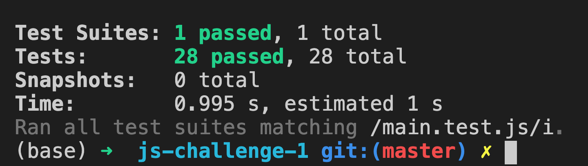

# Code Challenge - Javascript 5

- Over the next few weeks, we will be testing your knowledge on several code concpets to ensure that you understand them.
- These assessments are meant to give you coding practice
- We are here to help you get through them if needed.
- [Instructions](#instructions-to-use)
- [Submit your Challenge](#to-submit-your-challenge)

## Instructions to use

Start Coding - Open the `main.js` file and add your code in the file.

## To Test Your Changes
After you make the changes to the challenges, you can run a test to see if your answers are correct. You can run this as many times as needed until all the tests pass.

```
$ npm test main.test.js
```

#### Failing tests will have red in the final output


#### All passing tests will be green. This means you are completed with this exercise.


## To Submit Your Challenge

- After you have made all the code changes and run the tests locally and they all pass, add, commit and push the branch up to GitHub
- Create a PR against the main branch
- Check to make sure the tests are passing in github by looking either on the Checks tab of the pull request, or right above the Merge Pull Request button.
- If they do pass, merge the PR into master and copy the link to the repo to submit the Assignments card in CodeTracker.

## Don't Forget!

HAVE FUN!
